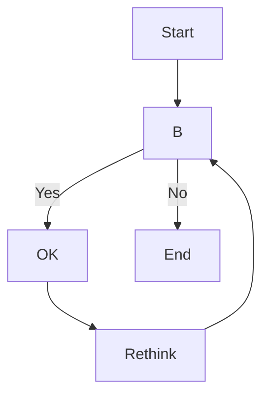
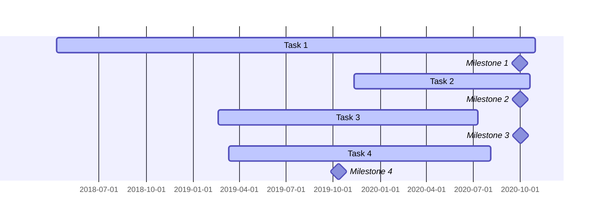
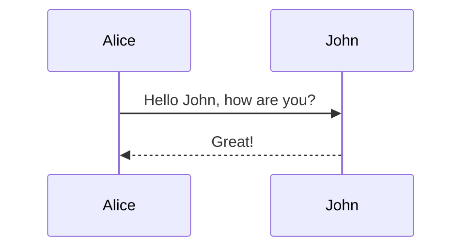
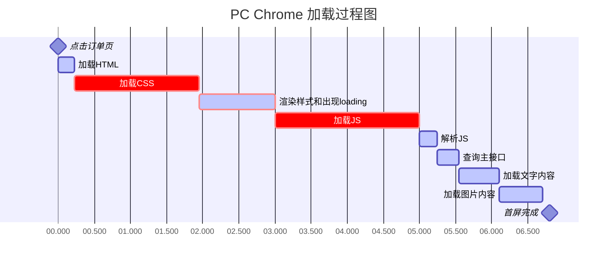

> 区块中使用列表
> 1. 第一项
> 2. 第二项
> + 第一项
> + 第二项
> + 第三项
___
* 第一项
    > 菜鸟教程
    > 学的不仅是技术更是梦想
* 第二项

___
- [x] 自定义MR评论模板
- [x] 新增MR增删行数统计显示
- [x] 提供返回label颜色的API
- [ ] 新增门禁检查功能
- [ ] 新增自定义群组功能

___
这是一个`printf()` 函数
___
	1234
    1234
    56635
___
```javascript
$(document).ready(function () {
    alert('RUNOOB');
});
```
___
# 一级标题
## 二级标题
### 三级标题
#### 四级标题
##### 五级标题
###### 六级标题

___
<style type="text/css">
h1 { counter-reset: h2counter; }
h2 { counter-reset: h3counter; }
h3 { counter-reset: h4counter; }
h4 { counter-reset: h5counter; }
h5 { counter-reset: h6counter; }
h6 { }
h2:before {
counter-increment: h2counter;
content: counter(h2counter) ".\0000a0\0000a0";
}
h3:before {
counter-increment: h3counter;
content: counter(h2counter) "."
counter(h3counter) ".\0000a0\0000a0";
}
h4:before {
counter-increment: h4counter;
content: counter(h2counter) "."
counter(h3counter) "."
counter(h4counter) ".\0000a0\0000a0";
}
h5:before {
counter-increment: h5counter;
content: counter(h2counter) "."
counter(h3counter) "."
counter(h4counter) "."
counter(h5counter) ".\0000a0\0000a0";
}
h6:before {
counter-increment: h6counter;
content: counter(h2counter) "."
counter(h3counter) "."
counter(h4counter) "."
counter(h5counter) "."
counter(h6counter) ".\0000a0\0000a0";
}
</style>
# C++ : 模板编程
## 非类型模板参数(Nontype Template Parameter)
### 非类型类模板参数(Nontype Class Template Parameter)
使用者自己定义,但是每个模板实例都是不同的类型;也可以为模板参数提供默认值；
___

这是一个链接 [链接](httpshttps://gitcode.com/GitCode/MarkdownTest/edit/test/other.md)
___

<https://gitcode.com/GitCode/MarkdownTest/edit/test/other.md>

___

* 第一项
* 第二项
* 第三项

___

+ 第一项
+ 第二项
+ 第三项

___

- 第一项
- 第二项
- 第三项

___
1. 第一项
2. 第二项
3. 第三项
___

1. 第一项:
    - 第一项嵌套的第一个元素
    - 第一项嵌套的第二个元素
2. 第二项:
    - 第二项嵌套的第一个元素
    - 第二项嵌套的第二个元素
___

$E = mc^2$
$\sqrt{3x-1}+(1+x)^2$
$$
\begin{Bmatrix}
   a & b \\
   c & d
\end{Bmatrix}
$$

___

# Flow chart

___
# Gantt chart

___
# Sequence chart


___

___

* 第一项第一项第一项第一项第一项第一项第一项第一项
* 第二项第二项第二项第二项第二项第二项第二项第二项
* 第三项第三项第三项第三项第三项第三项第三项第三项

___

1. 第一项第一项第一项第一项第一项第一项第一项第一项第一项
2. 第二项第二项第二项第二项第二项第二项第二项第二项第二项
3. 第三项第三项第三项第三项第三项第三项第三项第三项第三项

___
*斜体文本*

_斜体文本_
___
**粗体文本**

__粗体文本__
___
***粗斜体文本***

___粗斜体文本___
___
123
***
456
* * *
789
___
123
---
234

---
456
- - -
___
123
___
456
_ _ _
___
~~BAIDU.COM~~
___
<u>带下划线文本</u>
___


___


___

|  表头   | 表头  |
|  ----  | ----  |
| 单元格  | 单元格 |
| 单元格  | 单元格 |
___

| 左对齐左对齐 | 左对齐左对齐 | 左对齐左对齐 |
| :-----| :----- | :----- |
| 单元格 | 单元格 | 单元格 |
| 单元格 | 单元格 | 单元格 |

___

| 右对齐右对齐 | 右对齐右对齐 | 右对齐右对齐 |
| ----:| ----: | ----: |
| 单元格 | 单元格 | 单元格 |
| 单元格 | 单元格 | 单元格 |
___

| 居中对齐居中对齐 | 居中对齐居中对齐 | 居中对齐居中对齐 |
| :----:| :----: | :----: |
| 单元格 | 单元格 | 单元格 |
| 单元格 | 单元格 | 单元格 |

___
	tab
    123
___

= 和 - 标记语法格式如下:

我展示的是一级标题
=================

我展示的是二级标题
-----------------
___

# 一级标题
## 二级标题
### 三级标题
#### 四级标题
##### 五级标题
###### 六级标题

___
####### 这是一个七级标题
___


 @startuml
 class XSM_RECORD_INFO_S {
 usRecLen : 记录长度
 ucNumOfAttr : 应答字段数目
 ucDiffType : 增量同步类型
 pstFieldInfo : CFGI字段属性值
 <font color=blue>syscfgMark : 系统配置记录标识
 }
 class XSM_QUERY_RSP_DATA_S {
 usRecNum : 记录个数
 pstRecInfo : 实际类型为XSM_RECORD_INFO_S，保存无效field/默认值去除或XMLCahche合并后的字段属性
 ppvRecData : 上述记录后的数据信息
 pstOriRecInfo : 保存的原始CFGI应答中的记录字段信息，实际仅用于OCYang场景
 ppvOriRecData : 原始CFGI记录数据字段值，实际仅用于OCYang场景
 }
 class XSM_EDIT_OP_DATA_S {
 ucNumOfAttr
 ucNumOfClearAttr
 userKeyNum
 pucKeyIndex
 pucAttrIndex
 pucClearAttrIndex
 pstDataValue
 <font color=blue>syscfgMark : 系统配置记录标识
 <font color=blue>sysfldNum : 动态默认值字段数
 <font color=blue>dynAttrIndex : 动态默认值字段ID数组
 }
 XSM_QUERY_RSP_DATA_S o-left- XSM_RECORD_INFO_S : 聚合
 XSM_EDIT_OP_DATA_S -up- XSM_RECORD_INFO_S : usage
 @enduml
```
___
  

